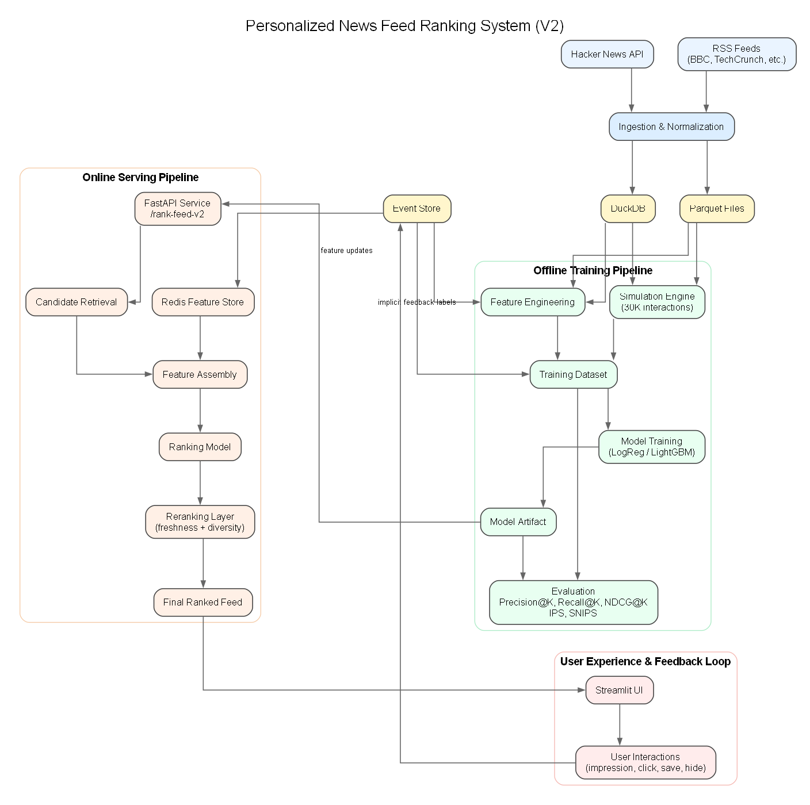
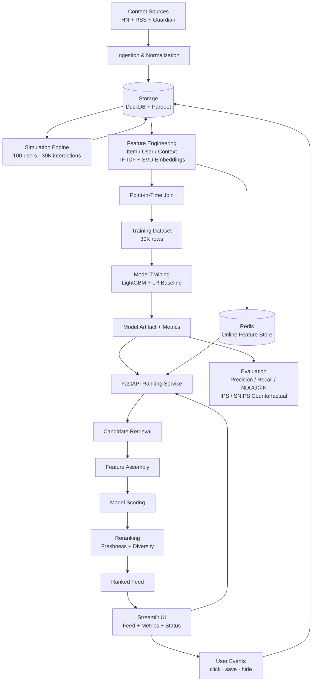
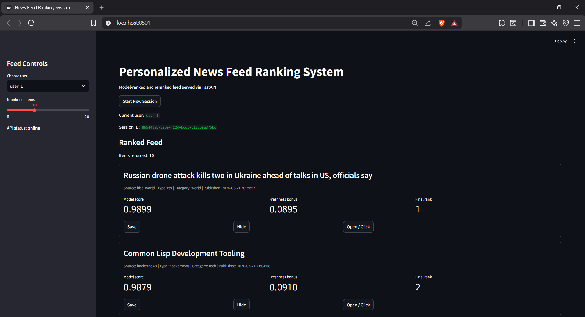
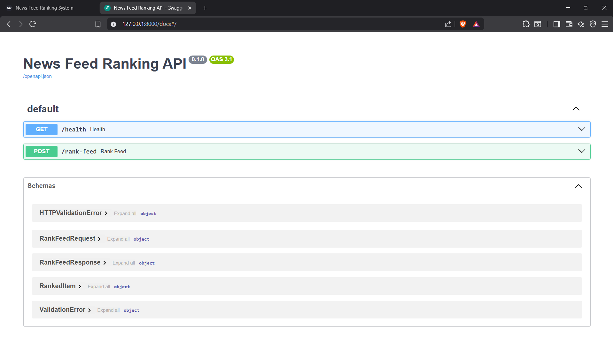

# Personalized News Feed Ranking System (V2)


A **production-inspired, end-to-end personalized news feed ranking system** built with a local-first stack. The project ingests real public content, simulates user behavior at scale, logs interactions, engineers user/item/context features with point-in-time correctness, trains ranking models, applies multi-objective reranking, evaluates using counterfactual estimation, and serves a personalized feed through a FastAPI backend and Streamlit frontend.

---

## Why This Project Is Different

Most portfolio ML projects:
- train a model on a static dataset
- stop at a notebook
- skip serving, evaluation, and feedback loops

This project builds the **complete ML system loop**:
- real + simulated data
- online + offline architecture
- ranking metrics + counterfactual evaluation
- production-inspired ML systems design

---

## Evolution: V1 → V2

### V1 (MVP)
- Real ingestion from Hacker News + RSS
- Event logging (impressions, clicks, saves, hides)
- Feature engineering (item, user, context)
- Logistic Regression baseline ranker
- FastAPI + Streamlit
- Multi-objective reranking (freshness + diversity)

### V2 (Production Upgrade)
- Behavioral simulation engine (30K interactions across 100 users)
- LightGBM ranking model (trained on simulated data)
- Candidate retrieval layer (popularity, recency, preference, blended)
- Redis online feature store with TTL and graceful fallback
- TF-IDF + SVD item embeddings and aggregated user embeddings
- Point-in-time correct feature joins (prevents training data leakage)
- Advanced evaluation: Precision/Recall/NDCG@K, feed quality metrics
- Counterfactual evaluation (IPS / SNIPS) for offline policy comparison
- Enhanced Streamlit UI: live API/Redis status, model metrics, clickable feed
- 43-test suite covering evaluation, reranking, and API endpoints

---

## Table of Contents

1. [Project Overview](#1-project-overview)
2. [Why This Project Matters](#2-why-this-project-matters)
3. [System Architecture](#3-system-architecture)
4. [Repository Structure](#4-repository-structure)
5. [Data Sources](#5-data-sources)
6. [Data Model and Storage Layers](#6-data-model-and-storage-layers)
7. [Event Logging Design](#7-event-logging-design)
8. [Simulation Engine](#8-simulation-engine)
9. [Feature Engineering](#9-feature-engineering)
10. [Training Dataset Construction](#10-training-dataset-construction)
11. [Modeling Approach](#11-modeling-approach)
12. [Multi-Objective Reranking](#12-multi-objective-reranking)
13. [Online Feature Store (Redis)](#13-online-feature-store-redis)
14. [Evaluation Framework](#14-evaluation-framework)
15. [Serving Architecture](#15-serving-architecture)
16. [Streamlit Demo UI](#16-streamlit-demo-ui)
17. [Test Suite](#17-test-suite)
18. [How to Run the Project](#18-how-to-run-the-project)
19. [Example End-to-End Workflow](#19-example-end-to-end-workflow)
20. [Current Results](#20-current-results)
21. [Design Decisions and Tradeoffs](#21-design-decisions-and-tradeoffs)
22. [Limitations](#22-limitations)
23. [Future Improvements](#23-future-improvements)
24. [License / Usage Notes](#24-license--usage-notes)

---

## 1) Project Overview

This repository implements a lightweight but realistic personalized feed ranking system inspired by the architecture of modern content platforms such as news apps, recommendation surfaces, and social feeds.

Instead of building only a notebook or a single ML model, this project focuses on the full ranking loop:

- ingesting real content from public sources
- simulating realistic user behavior to generate training data at scale
- storing normalized content and features in an analytical store
- showing ranked feed items to a user
- logging impressions and downstream actions
- constructing user, item, and context features with point-in-time correctness
- training a baseline and upgraded ranking model
- reranking results for freshness and diversity
- evaluating ranking quality offline and with counterfactual estimation
- serving ranked results through an API with a Redis feature store
- exposing the system through an interactive demo UI

The result is a portfolio-grade project that demonstrates machine learning, data engineering, product thinking, and ML systems design together.

---

## 2) Why This Project Matters

Many portfolio projects stop at a classification notebook or dashboard. That is useful, but it does not fully demonstrate how recommendation and ranking systems work in practice.

This project is intentionally designed to be stronger than a standard student project because it shows:

- **ranking instead of only classification**
- **event logging and implicit-feedback data collection**
- **behavioral simulation to overcome cold-start and data scarcity**
- **feature engineering across user, item, and context dimensions**
- **point-in-time correct joins to prevent training data leakage**
- **online/offline feature store separation using Redis and Parquet**
- **multi-objective reranking beyond pure CTR optimization**
- **counterfactual evaluation (IPS/SNIPS) for offline policy comparison**
- **separation of training logic and serving logic**
- **a test suite for ML system components**

It is especially relevant for applications in:

- Data Science / Applied ML
- Machine Learning Engineering
- Recommender Systems
- Data Engineering / ML Systems

---

## 3) System Architecture

### Architecture Diagram



### Mermaid Flowchart



### Component Summary

| Layer | Responsibility |
|---|---|
| Ingestion | Fetch and normalize content from public APIs and RSS feeds |
| Storage | DuckDB for content + events; Parquet bronze/silver/gold feature store |
| Simulation | Generate realistic interaction data to bootstrap training |
| Feature engineering | Build item, user, context features; TF-IDF + SVD embeddings |
| Model | Train LightGBM ranker + Logistic Regression baseline |
| Reranking | Multi-objective score adjustment for feed quality |
| Online store | Redis for low-latency feature retrieval at serving time |
| Evaluation | Precision/Recall/NDCG@K + IPS/SNIPS counterfactual estimation |
| API | FastAPI serving pipeline: retrieve → features → score → rerank |
| UI | Streamlit feed with live metrics, system status, and clickable articles |
| Tests | 43-test suite for evaluation, reranking, and API health |

---

## 4) Repository Structure

```text
news-feed-ranking-system/
│
├── README_Final.md
├── README_v0.1.md
├── requirements.txt
├── pyproject.toml
├── docker-compose.yml
├── Makefile
│
├── configs/
│   ├── config.yaml
│   ├── sources.yaml
│   ├── features.yaml          ← item / user / context feature definitions
│   └── model.yaml
│
├── data/
│   ├── raw/
│   ├── bronze/                ← normalized Parquet snapshots
│   ├── silver/                ← analytical tables
│   ├── gold/                  ← ML-ready feature parquets + training dataset
│   └── logs/
│
├── docs/
│   ├── screenshots/
│   │   ├── banner.webp
│   │   ├── feed.png
│   │   └── api.png
│   ├── images/
│   │   └── architecture.png
│   ├── architecture.md
│   ├── data_dictionary.md
│   ├── design_decisions.md
│   ├── evaluation_final.md
│   ├── feature_store_design.md
│   └── limitations_and_future_work.md
│
├── models_artifacts/
│   ├── logistic_model.joblib
│   └── lgbm_model.joblib
│
├── src/
│   ├── ingestion/             ← HN, RSS, Guardian ingestors + normalizer
│   ├── storage/               ← DuckDB client, Parquet I/O, Redis store
│   ├── events/                ← event schemas + logger
│   ├── features/              ← item/user/context/embedding/similarity pipelines
│   ├── simulation/            ← behavioral simulator, catalog builder, training generator
│   ├── models/                ← train, evaluate, predict (LR + LightGBM)
│   ├── reranking/             ← diversity, freshness, candidate retrieval, score combiner
│   ├── evaluation/            ← ranking metrics, feed quality metrics, counterfactual eval
│   ├── api/                   ← FastAPI app, ranking service, V1 + V2 endpoints, schemas
│   ├── ui/                    ← Streamlit app + feedback handler
│   └── utils/                 ← config loader
│
├── tests/
│   ├── conftest.py
│   ├── test_evaluation_metrics.py   ← 19 tests: Precision/Recall/NDCG/diversity/freshness
│   ├── test_reranking.py            ← 18 tests: diversity reranking, freshness bonus, candidates
│   └── test_api_health.py           ← 6 tests: health check, V2 endpoint, schema validation
│
└── check_*.py                 ← local debug/inspection scripts
```

---

## 5) Data Sources

### Current Sources

- **Hacker News API** — top stories, tech-focused, free public API
- **RSS feeds** — BBC World, TechCrunch, Ars Technica, VentureBeat
- **The Guardian API** — editorial news with category metadata

### Why These Sources Were Chosen

- free and easy to access
- sufficient topic variety for a feed-style ranking system
- fast local iteration without cloud dependencies

### Unified Content Schema

All sources are normalized into a common structure:

| Field | Description |
|---|---|
| `item_id` | Unique identifier |
| `source` | Source name (e.g., `hackernews`, `bbc`) |
| `source_type` | `api` or `rss` |
| `title` | Article title |
| `description` | Short summary |
| `url` | Article URL |
| `author` | Author if available |
| `published_at` | Publication timestamp |
| `fetched_at` | Ingestion timestamp |
| `category` | Content category |
| `topic` | Sub-topic |
| `language` | Language code |
| `content_length` | Character count of description |

---

## 6) Data Model and Storage Layers

### Raw Layer

Stores raw API/feed payloads for reproducibility.

### Bronze Layer

Normalized content snapshots stored in Parquet, partitioned by source and date.

### Silver Layer

Cleaned analytical tables in DuckDB:

- `content_items` — all normalized articles
- `events` — all user interaction events

### Gold Layer

ML-ready Parquet outputs:

- `item_embeddings.parquet` — TF-IDF + SVD item vectors
- `user_embeddings.parquet` — aggregated user preference vectors
- `item_features.parquet` — CTR, freshness, popularity features
- `user_features.parquet` — historical CTR, preferred source/category
- `context_features.parquet` — time-of-day, weekday features
- `training_dataset.parquet` — point-in-time joined training rows

### Online Store (Redis)

User and item features materialized into Redis with TTL for low-latency serving. Falls back gracefully if Redis is unavailable.

### Why DuckDB + Parquet + Redis

- **DuckDB + Parquet**: simple local setup, analytical SQL, reproducible pipelines, no cloud cost
- **Redis**: industry-standard online feature store; enables offline/online consistency at serving time

---

## 7) Event Logging Design

A ranking system is only as useful as the interaction data it collects.

### Event Types Implemented

| Event | Description |
|---|---|
| `feed_request` | User requested a ranked feed |
| `impression` | Item was shown to the user |
| `click` | User clicked the item |
| `save` | User saved the item |
| `hide` | User hid the item |

### Core Event Fields

- `event_id`, `timestamp`, `user_id`, `session_id`
- `event_type`, `item_id`, `rank_position`
- `model_version`, `score`, `policy_name`, `metadata`

### Why Impressions Are Critical

A feed ranking dataset cannot be built from clicks alone. The system must know:

- what the user **saw** (impression)
- what the user **clicked** (positive label)
- what the user **ignored** (negative label)

Impressions are therefore the base population; clicks are labels applied on top. This is one of the most important design choices in a real recommender system.

---

## 8) Simulation Engine

### Why Simulation

Real interaction data takes time to accumulate, and a ranking system needs volume to train. The simulation engine generates realistic synthetic behavioral data to bootstrap model training without waiting for live traffic.

### What It Simulates

- **Position bias**: items ranked higher are more likely to be clicked
- **Recency bias**: newer items have a baseline click boost
- **User preference affinity**: each simulated user has a preferred category and source

### Scale

| Dimension | Value |
|---|---|
| Simulated users | 100 |
| Items in catalog | 300+ |
| Sessions per user | 25 |
| Items per session | 12 |
| Total interactions | ~30,000 |

### Output

The simulator generates impression + click logs that feed directly into the feature engineering and model training pipeline, enabling a cold-start-free training regime.

---

## 9) Feature Engineering

The project builds features across three dimensions plus derived interaction features.

### A) Item Features

| Feature | Description |
|---|---|
| `age_hours` | Time since publication |
| `title_length` | Character count of title |
| `description_length` | Character count of description |
| `source` | Source name |
| `category` | Content category |
| `hour_published` | Hour of day published |
| `weekday_published` | Day of week published |
| `item_ctr` | Historical click-through rate |
| `item_popularity` | Total impression count |
| `is_hackernews` / `is_rss` | Source type flags |

### B) Item Embeddings

TF-IDF vectorization on title + description, reduced with SVD to produce dense item embeddings. Used to build user embedding centroids from click history.

### C) User Features

| Feature | Description |
|---|---|
| `user_ctr` | Historical click-through rate |
| `recent_impression_count` | Impressions in recent window |
| `recent_click_count` | Clicks in recent window |
| `recent_save_count` | Saves in recent window |
| `recent_hide_count` | Hides in recent window |
| `preferred_source` | Most-clicked source |
| `preferred_category` | Most-clicked category |

### D) Context Features

| Feature | Description |
|---|---|
| `hour_of_day` | Hour of the feed request |
| `weekday` | Day of week |
| `is_weekend` | Boolean weekend flag |

### E) Derived Match Features

- `preferred_source_match` — candidate source matches user's preferred source
- `preferred_category_match` — candidate category matches user's preferred category
- `user_item_similarity` — cosine similarity between user embedding and item embedding

### Point-in-Time Correctness

All features are joined using a point-in-time join on the impression timestamp. This ensures that no future data leaks into training rows, preventing the most common source of offline/online metric discrepancy in recommender systems.

---

## 10) Training Dataset Construction

### Positive Examples

An impression becomes a positive training example when the same user clicked the same item in the same session.

### Negative Examples

An impression becomes a negative training example when it was shown but not clicked.

### Training Row Structure

Each row combines:

- impression metadata (user_id, session_id, item_id, rank_position, timestamp)
- item features (CTR, freshness, embeddings, metadata)
- user features (historical CTR, preferences)
- context features (time of day, weekday)
- label: `clicked` (1 or 0)

### Why This Framing

Pointwise click prediction on impression logs is a practical first baseline. It is simple, explainable, and sufficient to establish a full ranking pipeline before moving into pairwise or listwise learning-to-rank approaches.

---

## 11) Modeling Approach

### Models Trained

| Model | Role |
|---|---|
| Logistic Regression | Interpretable baseline, fast to train |
| LightGBM | Stronger non-linear ranker on mixed tabular features |

### Preprocessing Pipeline

- Imputation for missing numeric values
- One-hot encoding for categorical variables
- Probability output used as `model_score`

### Training Data

Trained on 30,000 simulated interactions (100 users × 25 sessions × 12 items), enabling a robust baseline without waiting for live data accumulation.

### Model Output

For each candidate item, the model produces a `model_score` interpreted as a click probability proxy, which feeds into the reranking layer.

### Evaluation Caveat

Offline metrics are computed on held-out simulated data. They validate the pipeline and relative model comparison, not final production-level performance.

---

## 12) Multi-Objective Reranking

Model score alone does not produce a good feed. Sorting only by predicted click probability can result in:

- repetitive content from the same source
- category concentration
- stale articles ranked above fresh ones

### Reranking Formula

```text
final_score = model_score
            + freshness_bonus
            - category_repeat_penalty
            - source_repeat_penalty
```

### Objectives

#### Freshness Bonus
Items published more recently receive an additional score boost proportional to recency.

#### Category Repetition Penalty
Items are penalized if too many already-selected items share the same category.

#### Source Repetition Penalty
Items are penalized when the selected feed is over-concentrated on a single source.

### Why This Matters

This layer demonstrates product-aware feed design beyond pure CTR optimization. It shows understanding of **diversity vs. relevance** and **freshness vs. engagement** tradeoffs — a key signal in ML system interviews.

---

## 13) Online Feature Store (Redis)

### Role

Redis bridges the gap between offline feature computation (Parquet) and online inference. Features for users and items are materialized into Redis with a TTL so they are available at request time with low latency.

### Design

- **Offline pipeline**: computes features from Parquet and writes to Redis keys
- **Online pipeline**: FastAPI reads from Redis on each request
- **Graceful fallback**: if Redis is unavailable, the API falls back to loading features from Parquet directly

### Why This Matters

The offline/online feature store split is standard in production ML systems. Including it here — even locally — demonstrates awareness of the serving layer challenges that matter most in industry.

---

## 14) Evaluation Framework

### Ranking Metrics (Offline)

Computed on held-out impression data:

| Metric | What it measures |
|---|---|
| Precision@K | Fraction of top-K items that were clicked |
| Recall@K | Fraction of all clicked items that appear in top-K |
| NDCG@K | Ranking quality with position-weighted relevance |

### Feed Quality Metrics

| Metric | What it measures |
|---|---|
| Category Diversity@K | Variety of content categories in top-K feed |
| Source Diversity@K | Variety of sources, prevents single-source dominance |
| Freshness@K | Average age of items in top-K feed |

### Counterfactual Evaluation (IPS / SNIPS)

Counterfactual evaluation estimates how a **new ranking policy** would perform using only **logged data from an old policy** — without running a live A/B test.

#### IPS (Inverse Propensity Score)

Reweights observed outcomes by the probability that the logged policy would have shown that item:

```text
IPS = (1/n) × Σ [ reward_i × (π_new(a_i|x_i) / π_log(a_i|x_i)) ]
```

#### SNIPS (Self-Normalized IPS)

Stabilizes IPS by normalizing by the sum of importance weights, reducing variance from extreme propensity ratios:

```text
SNIPS = Σ [ reward_i × w_i ] / Σ [ w_i ]
```

#### Why Counterfactual Evaluation Matters

It allows:
- offline comparison of ranking policies without live experiments
- estimation of new model performance before deployment
- a realistic feedback loop between model training and policy improvement

**Limitation**: because the logged data here is simulated, these estimates are useful as approximations and relative comparisons rather than true causal inference.

### Metrics Snapshot

| Metric | Value |
|---|---|
| Precision@5 | ≈ 0.34 |
| Recall@5 | ≈ 0.53 |
| NDCG@5 | ≈ 0.83 |
| IPS | ≈ 0.2604 |
| SNIPS | ≈ 0.2585 |

*Computed on simulated data; values validate pipeline correctness and relative model ranking.*

---

## 15) Serving Architecture

### FastAPI Endpoints

#### `GET /health`

Basic health check. Returns API status and Redis connectivity.

#### `POST /rank-feed`

V1 endpoint. Accepts `user_id`, `session_id`, `limit`. Returns ranked items with full article metadata (title, URL, published date), model scores, freshness bonus, and final rank.

#### `POST /rank-feed-v2`

V2 ML pipeline endpoint. Full serving pipeline:

```
retrieve candidates
    → assemble features (Redis + Parquet fallback)
    → score with LightGBM
    → apply multi-objective reranking
    → return ranked feed
```

### Endpoint Comparison

| | `/rank-feed` (V1) | `/rank-feed-v2` (V2) |
|---|---|---|
| Candidate source | DuckDB | Parquet feature store |
| Feature source | Inline computation | Redis (+ Parquet fallback) |
| Model | Logistic Regression | LightGBM |
| Article metadata | Yes (title, URL) | Feature columns only |
| Used by Streamlit | Yes | — |

---

## 16) Streamlit Demo UI

The frontend is built with Streamlit and connects to the FastAPI backend.

### Feed View

- Select user identity (user_1, user_2, user_3)
- Request a new ranked feed
- View ranked articles as clickable hyperlinks
- See model score and reranking metadata per item
- Interact via Save, Hide, or Open Article buttons
- All interactions are automatically logged as events

### Sidebar

- **System Status panel**: live API health check + Redis connectivity status
- **Model Metrics**: AUC score from `metrics_v2.json`
- **IPS / SNIPS scores**: counterfactual evaluation estimates displayed at a glance
- **"How This Works" expander**: explains the ML pipeline stages in plain language
- **New Session** button to reset session state

### Screenshots

#### Feed View


#### API Response


---

## 17) Test Suite

A 43-test suite covers three areas of the system:

### `tests/test_evaluation_metrics.py` — 19 tests

- Precision@K: empty feed, all-relevant, partial hits, K > feed size
- Recall@K: zero relevant, full recall, partial recall
- NDCG@K: perfect ordering, reversed ordering, partial hits
- Category Diversity@K: single category, all unique, mixed
- Freshness@K: all fresh, all stale, mixed
- Source Diversity@K: single source, multi-source

### `tests/test_reranking.py` — 18 tests

- Diversity reranking: category penalty, source penalty, combined
- Freshness bonus: recent items boosted, stale items unchanged
- Score combiner: correct final_score formula
- Candidate generation: popularity-based, recency-based, blended retrieval
- Edge cases: empty candidate pool, single item, duplicate sources

### `tests/test_api_health.py` — 6 tests

- `GET /health` returns 200 with expected schema
- `POST /rank-feed-v2` returns valid response for known users
- Schema validation on rank-feed-v2 response fields
- Graceful handling of unknown user_id
- Redis fallback path (when Redis is not running)

### Running Tests

```bash
make test
# or
pytest tests/ -v
```

---

## 18) How to Run the Project

### Prerequisites

- Python 3.11
- Docker (for Redis; optional — system falls back gracefully without it)

### Quick Start (Makefile)

```bash
# Install dependencies
make install

# (Optional) Start Redis online feature store
make run-redis

# Start FastAPI backend
make run-api

# In a second terminal: start Streamlit UI
make run-ui

# Or launch everything at once (Redis + API + UI)
make demo

# Run test suite
make test
```

### Manual Step-by-Step

#### 1. Create and activate virtual environment

```bash
python -m venv .venv
# Windows PowerShell
.venv\Scripts\Activate.ps1
# Unix / macOS
source .venv/bin/activate
```

#### 2. Install dependencies

```bash
pip install -r requirements.txt
```

#### 3. Run ingestion

```bash
python -m src.ingestion.hn_ingest
python -m src.ingestion.rss_ingest
```

#### 4. Verify content tables

```bash
python check_data.py
```

#### 5. Run simulation to generate training data

```bash
python -m src.simulation.simulate_events_v2
python -m src.simulation.build_training_from_simulation_v2
```

#### 6. Build feature tables

```bash
python -m src.features.build_item_embeddings_v2
python -m src.features.build_user_embeddings_v2
python -m src.features.build_historical_features_v2
python -m src.features.build_impressions_v2
python -m src.features.point_in_time_join_v2
```

#### 7. Train the model

```bash
python -m src.models.train_simulated_v2
```

#### 8. (Optional) Materialize features to Redis

```bash
python -m src.storage.materialize_features_to_redis_v2
```

#### 9. Start FastAPI service

```bash
# Linux/macOS
PYTHONPATH=. uvicorn src.api.main:app --reload --port 8000

# Windows PowerShell
$env:PYTHONPATH="."
uvicorn src.api.main:app --reload --port 8000
```

#### 10. Start Streamlit UI

In a second terminal:

```bash
# Linux/macOS
PYTHONPATH=. streamlit run src/ui/streamlit_app.py

# Windows PowerShell
$env:PYTHONPATH="."
streamlit run src/ui/streamlit_app.py
```

#### 11. Verify event logging

```bash
python check_events.py
```

---

## 19) Example End-to-End Workflow

A typical local workflow looks like this:

1. Ingest fresh public content from HN, RSS, and Guardian.
2. Run the simulation engine to generate 30K synthetic interactions.
3. Build point-in-time correct feature tables.
4. Train the LightGBM ranker; evaluate offline metrics.
5. Materialize features to Redis.
6. Launch the FastAPI ranking service.
7. Launch the Streamlit UI.
8. Request a ranked feed for a given user.
9. The API retrieves candidates, assembles features from Redis, scores with LightGBM, and applies reranking.
10. The user sees the ranked feed with clickable articles.
11. User interactions (clicks, saves, hides) are logged as events back into DuckDB.
12. Feature tables and training data are rebuilt from accumulated events.
13. The model is retrained with fresh data.

This closes the ranking loop in a production-inspired way.

---

## 20) Current Results

### System Status

The full pipeline is implemented, tested, and runnable end-to-end:

- real ingestion from three public sources
- clean content normalization and DuckDB storage
- behavioral simulation at 30K-interaction scale
- point-in-time feature engineering with TF-IDF + SVD embeddings
- LightGBM ranker trained on simulated data
- Redis online feature store with graceful fallback
- FastAPI ranking service (V1 + V2 endpoints)
- Multi-objective reranking (freshness + diversity)
- IPS/SNIPS counterfactual evaluation
- Enhanced Streamlit UI with live metrics and clickable feed
- 43-test suite, all passing

### Offline Metrics

| Metric | Value |
|---|---|
| Precision@5 | ≈ 0.34 |
| Recall@5 | ≈ 0.53 |
| NDCG@5 | ≈ 0.83 |
| IPS | ≈ 0.2604 |
| SNIPS | ≈ 0.2585 |

### Training Data Scale

| Dimension | Value |
|---|---|
| Simulated users | 100 |
| Items in catalog | ~300 |
| Total interactions | ~30,000 |
| Real content items (DuckDB) | 348 |

---

## 21) Design Decisions and Tradeoffs

### Why a multi-stage pipeline?

Real-world ranking systems separate retrieval, ranking, and reranking because:
- retrieval operates at scale (millions of candidates) with cheap methods
- ranking applies a full ML model to a small candidate set
- reranking applies product constraints and diversity objectives

This project mirrors that three-stage structure at a local scale.

### Why simulation instead of waiting for real clicks?

Real interaction data takes time to accumulate. A simulator allows:
- training a model immediately
- controlling for position bias explicitly
- generating data at a scale that real usage would take months to produce

The simulator models position bias, recency bias, and user preference affinity.

### Why Redis for online features?

Redis separates offline feature computation from online serving — a standard industry pattern. Including it demonstrates awareness of the offline/online consistency problem, one of the hardest operational challenges in production ML systems.

### Why start with Logistic Regression before LightGBM?

Because the goal of the MVP was to validate the full system loop first:

- ingestion → events → features → labels → model → serving → reranking

A simple, interpretable baseline is the right engineering starting point. LightGBM was added as an upgrade once the pipeline was confirmed end-to-end.

### Why local-first (DuckDB / Parquet / local Redis)?

The project is designed to be:
- free or nearly free to run
- easy to set up locally
- realistic in architecture without cloud complexity
- finishable without AWS or GCP spend

This is a portfolio project optimized for learning signal, explainability, and interview value — not unnecessary operational complexity.

### Why not Kafka / feature platforms / orchestration?

Those would overcomplicate the MVP. The project deliberately prefers:
- realistic architecture principles (multi-stage pipeline, online/offline separation)
- manageable implementation scope
- strong explanation value in interviews

---

## 22) Limitations

### Current Known Limitations

| Limitation | Notes |
|---|---|
| Simulated training data | Real user clicks would require live traffic |
| No live A/B testing | Counterfactual eval approximates this offline |
| V2 endpoint lacks article metadata | title/url/published_at only available in DuckDB (V1); fixable with a join |
| scipy version pinned at 1.13.1 | Installed version may differ on fresh installs |
| No pairwise/listwise ranking | Pointwise click prediction is the current framing |
| No semantic reranking | Embedding similarity not yet used in reranking layer |
| No monitoring dashboards | Evaluation is offline only |

---

## 23) Future Improvements

### Modeling

- Pairwise or listwise learning-to-rank (LambdaRank, LambdaMART)
- Two-tower retrieval model for embedding-based candidate generation
- Better calibration checks (reliability diagrams)

### Personalization

- Semantic search using sentence-transformer embeddings
- User embedding centroid from clicked content at serving time
- Real-time content affinity signals

### Feature System

- Stricter feature freshness guarantees in Redis TTL management
- Streaming feature updates (e.g., Kafka → Redis)
- Online/offline consistency validation checks

### Evaluation

- Doubly Robust (DR) estimator for counterfactual evaluation
- Interleaving experiments for implicit A/B comparison
- Policy comparison visualizations

### Product / System

- Exploration bucket (ε-greedy or UCB) for new content discovery
- Debug/inspection endpoints for ranking explanation
- Monitoring dashboards for feed quality over time

---

## 24) License / Usage Notes

This project is intended for educational, portfolio, and interview use.

Content is sourced from public APIs and feeds and should be handled according to the terms of the underlying providers (Hacker News API, RSS feeds, The Guardian API).

---

## Final Takeaway

This is not a notebook.

This is not a toy project.

It is a **production-inspired end-to-end recommender system** that demonstrates:

- the full ranking lifecycle (ingest → simulate → feature → train → serve → evaluate)
- online/offline ML system architecture
- product-aware feed design
- counterfactual evaluation for offline policy comparison
- engineering discipline through a tested, modular codebase
