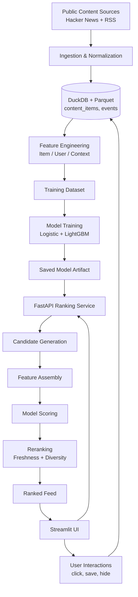

# Personalized News Feed Ranking System


A production-inspired, end-to-end personalized news feed ranking system built with a local-first stack. The project ingests real public content, logs user interactions, engineers user/item/context features, trains a baseline click-prediction ranker, applies multi-objective reranking, and serves a personalized feed through a FastAPI backend and Streamlit frontend.

## Key Highlights

- End-to-end ML system (not just a model)
- Real content ingestion (Hacker News + RSS)
- Event-driven training dataset (impressions + clicks)
- Logistic Regression + LightGBM ranking models
- Multi-objective reranking (freshness + diversity)
- FastAPI serving + Streamlit UI

---

## Table of Contents

1. Project Overview  
2. Why This Project Matters  
3. What the System Does  
4. Key Capabilities  
5. System Architecture  
6. Repository Structure  
7. Data Sources  
8. Data Model and Storage Layers  
9. Event Logging Design  
10. Feature Engineering  
11. Training Dataset Construction  
12. Modeling Approach  
13. Multi-Objective Re-Ranking  
14. Serving Architecture  
15. Streamlit Demo UI  
16. How to Run the Project  
17. Example End-to-End Workflow  
18. Current Results  
19. Design Decisions and Tradeoffs  
20. Limitations  
21. Future Improvements  
22. License / Usage Notes

---

## 1) Project Overview

This repository implements a lightweight but realistic personalized feed ranking system inspired by the architecture of modern content platforms such as news apps, recommendation surfaces, and social feeds.

Instead of building only a notebook or a single ML model, this project focuses on the full ranking loop:

- ingesting real content from public sources
- storing normalized content in an analytical store
- showing ranked feed items to a user
- logging impressions and downstream actions
- constructing user, item, and context features
- training a baseline ranking model
- reranking results for freshness and diversity
- serving ranked results through an API
- exposing the system through a usable demo UI

The result is a portfolio-grade project that demonstrates machine learning, data engineering, product thinking, and ML systems design together.

---

## 2) Why This Project Matters

Many portfolio projects stop at a classification notebook or dashboard. That is useful, but it does not fully demonstrate how recommendation and ranking systems work in practice.

This project is intentionally designed to be stronger than a standard student project because it shows:

- **ranking instead of only classification**
- **event logging and implicit-feedback data collection**
- **feature engineering across user, item, and context dimensions**
- **separation of training logic and serving logic**
- **product-aware feed design beyond pure CTR optimization**
- **realistic engineering tradeoffs using a local-first, low-cost stack**

It is especially relevant for applications in:

- Data Science
- Machine Learning Engineering
- Applied ML
- Recommender Systems
- Data Engineering / ML Systems
- Analytics engineering-adjacent roles

---

## 3) What the System Does

At a high level, the system answers the question:

**“Which items should this user see right now, and in what order?”**

To answer that, it performs the following steps:

1. Ingest recent articles/posts from public sources such as Hacker News and RSS feeds.
2. Normalize and store content in DuckDB.
3. Show feed items to the user in a Streamlit interface.
4. Log feed requests, impressions, clicks, saves, and hides.
5. Build feature tables for items, users, and request context.
6. Construct a training dataset from impression/click logs.
7. Train a baseline click-prediction model.
8. Score candidate items for a given user.
9. Apply reranking for freshness and reduced repetition.
10. Return a ranked feed through FastAPI.

---

## 4) Key Capabilities

### Implemented in the current MVP

- Real content ingestion from public sources
- Unified content schema
- DuckDB + Parquet storage
- Streamlit feed UI
- Event logging for feed interactions
- Feature engineering pipelines
- Impression-based training dataset
- Baseline Logistic Regression ranking model
- FastAPI ranking endpoint
- Multi-objective reranking with freshness and repetition penalties
- UI integration with API-based scoring

### Planned or partially scaffolded for later versions

- LightGBM / XGBoost comparison
- sentence-transformer embeddings
- Redis online feature materialization
- stricter point-in-time joins
- off-policy / counterfactual evaluation
- simulator-assisted data generation

---

## 5) System Architecture

### High-level flow



### Component summary

- **Ingestion layer**: fetches and normalizes content from public APIs and feeds.
- **Storage layer**: stores normalized content and events in DuckDB; feature tables in Parquet.
- **Feature layer**: builds item, user, and context features.
- **Model layer**: trains a pointwise click-prediction model.
- **Reranking layer**: improves feed quality using freshness and repetition penalties.
- **Serving layer**: exposes ranking functionality through FastAPI.
- **Demo layer**: Streamlit UI for feed interaction and inspection.

---

## 6) Repository Structure

```text
news-feed-ranking-system/
│
├── README.md
├── requirements.txt
├── pyproject.toml
├── docker-compose.yml
├── Makefile
│
├── configs/
│   ├── config.yaml
│   ├── sources.yaml
│   ├── features.yaml
│   └── model.yaml
│
├── data/
│   ├── raw/
│   ├── bronze/
│   ├── silver/
│   ├── gold/
│   └── logs/
│
├── docs/
│   ├── screenshots/
│   ├── architecture.md
│   ├── architecture_mermaid.md
│   ├── data_dictionary.md
│   ├── feature_store_design.md
│   └── evaluation.md
│
├── models_artifacts/
│   └── logistic_model.joblib
│
├── src/
│   ├── ingestion/
│   ├── storage/
│   ├── events/
│   ├── features/
│   ├── models/
│   ├── reranking/
│   ├── api/
│   ├── ui/
│   └── utils/
│
├── check_data.py
├── check_events.py
└── check_training_data.py
```

---

## 7) Data Sources

The MVP uses free/public sources.

### Current sources

- **Hacker News API**
- **RSS feeds** such as BBC World, TechCrunch, Ars Technica, VentureBeat

### Why these sources were chosen

- easy to access
- free to use
- sufficient variety for a feed-style ranking system
- fast iteration without cloud dependencies

### Unified content schema

All sources are normalized into a common structure with fields such as:

- `item_id`
- `source`
- `source_type`
- `title`
- `description`
- `url`
- `author`
- `published_at`
- `fetched_at`
- `category`
- `topic`
- `language`
- `content_length`

This makes downstream feature engineering and model training much easier.

---

## 8) Data Model and Storage Layers

### Raw layer

Stores raw API/feed payloads for reproducibility.

### Bronze layer

Stores normalized content snapshots in Parquet.

### Silver layer

Stores cleaned analytical tables in DuckDB, including:

- `content_items`
- `events`

### Gold layer

Stores ML-ready outputs such as:

- `item_features.parquet`
- `user_features.parquet`
- `context_features.parquet`
- `training_dataset.parquet`

### Why DuckDB + Parquet

This combination provides:

- simple local setup
- analytical SQL support
- reproducible pipelines
- lightweight storage
- no cloud spend

It is a strong fit for a portfolio project that aims to stay realistic without overengineering.

---

## 9) Event Logging Design

A ranking system is only as useful as the interaction data it collects.

### Event types implemented

- `feed_request`
- `impression`
- `click`
- `save`
- `hide`

### Core event fields

- `event_id`
- `timestamp`
- `user_id`
- `session_id`
- `event_type`
- `item_id`
- `rank_position`
- `model_version`
- `score`
- `policy_name`
- `metadata`

### Why impressions are critical

A feed ranking dataset cannot be built from clicks alone. We must know:

- what the user **saw**
- what the user **clicked**
- what the user **ignored**

This project therefore treats impressions as the base population and assigns click labels on top of them.

That is a core recommender-systems concept and one of the most important pieces of the pipeline.

---

## 10) Feature Engineering

The project builds three kinds of features.

### A) Item features

Examples:

- `age_hours`
- `title_length`
- `description_length`
- `source`
- `source_type`
- `category`
- `hour_published`
- `weekday_published`
- `is_hackernews`
- `is_rss`

These capture freshness, metadata, and content origin.

### B) User features

Examples:

- `recent_impression_count`
- `recent_click_count`
- `recent_save_count`
- `recent_hide_count`
- `preferred_source`
- `preferred_category`

These capture recent behavior and coarse user preferences.

### C) Context features

Examples:

- `hour_of_day`
- `weekday`
- `is_weekend`

These capture request-time conditions.

### Derived match features

The pipeline also creates useful interaction features such as:

- `preferred_source_match`
- `preferred_category_match`

These help the model learn whether a candidate aligns with recent user behavior.

---

## 11) Training Dataset Construction

The training dataset is built from impression logs.

### Positive examples

An impression becomes a positive example if the same user clicked the same item in the same session.

### Negative examples

An impression becomes a negative example if it was shown but not clicked.

### Resulting dataset

Each training row combines:

- impression metadata
- item features
- user features
- context features
- label: `clicked`

This is a practical first step for pointwise ranking.

### Why this framing is useful

It is simple, explainable, and good enough to establish a baseline ranking pipeline before moving into more advanced learning-to-rank approaches.

---

## 12) Modeling Approach

### Current baseline

The first working model is a **Logistic Regression** classifier used as a pointwise ranker.

### Modeling
- Baseline: Logistic Regression
- Upgrade: LightGBM for stronger non-linear modeling on mixed tabular ranking features
- Saved both models and compared offline metrics
- API can serve the configured default model

### Why start with Logistic Regression

- fast to train
- highly interpretable
- stable baseline
- easy to debug
- good for validating the end-to-end system

### Preprocessing pipeline

The model pipeline includes:

- imputation for missing numeric values
- one-hot encoding for categorical variables
- Logistic Regression probability output

### Model output

For each candidate item, the model produces a `model_score`, interpreted as a click probability proxy.

### Current evaluation caveat

The initial dataset is intentionally small. Therefore, offline results should be interpreted as **pipeline validation**, not final production-level performance.

---

## 13) Multi-Objective Re-Ranking

Model score alone is not enough for a good feed.

If we sort only by predicted click probability, the feed may become:

- too repetitive
- too concentrated on one source
- less fresh
- less diverse

### Current reranking formula

```text
final_score = model_score + freshness_bonus - category_repeat_penalty - source_repeat_penalty
```

### Implemented reranking objectives

#### Freshness bonus

Newer items receive an additional score boost.

#### Category repetition penalty

Items are penalized if too many already-selected items share the same category.

#### Source repetition penalty

Items are penalized if the feed over-concentrates on the same source.

### Why this matters

This layer shows product understanding beyond pure CTR optimization. It makes the project substantially stronger in interviews because it demonstrates awareness of feed quality, not just model quality.

---

## 14) Serving Architecture

### FastAPI endpoints

#### `GET /health`
Basic health check.

#### `POST /rank-feed`
Accepts:

- `user_id`
- `session_id`
- `limit`

Returns:

- ranked items
- model scores
- freshness bonus
- final rank

### Ranking flow

1. Load recent candidate items.
2. Build user-aware scoring frame.
3. Score candidates with the trained model.
4. Apply reranking.
5. Return top ranked items.

This design cleanly separates scoring logic from the UI.

---

## 15) Streamlit Demo UI

The frontend is built with Streamlit to make the system easy to demo.

### Current UI capabilities

- choose user identity
- start new session
- request ranked feed from FastAPI
- view model score and reranking metadata
- click Save / Hide / Open
- automatically log impressions

### Why Streamlit was used

- fast to build
- recruiter/demo friendly
- easy local iteration
- makes the project much easier to understand visually

---

## 16) How to Run the Project

### 1. Create and activate virtual environment

Windows PowerShell example:

```bash
python -m venv .venv
.venv\Scripts\Activate.ps1
```

### 2. Install dependencies

```bash
pip install -r requirements.txt
```

### 3. Run ingestion

```bash
python -m src.ingestion.hn_ingest
python -m src.ingestion.rss_ingest
```

### 4. Verify content tables

```bash
python check_data.py
```

### 5. Interact with UI to generate events (optional early step)

```bash
streamlit run src/ui/streamlit_app.py
```

### 6. Build features

```bash
python -m src.features.item_features
python -m src.features.user_features
python -m src.features.context_features
python -m src.features.dataset_builder
```

### 7. Verify training data

```bash
python check_training_data.py
```

### 8. Train the baseline model

```bash
python -m src.models.train
```

### 9. Start FastAPI service

```bash
$env:PYTHONPATH="."
uvicorn src.api.main:app --reload --port 8000
```

### 10. Start Streamlit UI connected to API

In a second terminal:

```bash
.venv\Scripts\Activate.ps1
$env:PYTHONPATH="."
streamlit run src/ui/streamlit_app.py
```

### 11. Verify event logging

```bash
python check_events.py
```

---

## 17) Example End-to-End Workflow

A typical local workflow looks like this:

1. Ingest fresh public content.
2. Launch the API.
3. Launch the Streamlit app.
4. Request a feed for a given user.
5. The API loads candidates and scores them.
6. Reranking adjusts the final ordering.
7. The user sees the ranked feed.
8. Feed requests, impressions, clicks, saves, and hides are logged.
9. Feature tables and training data are rebuilt.
10. The baseline model is retrained.

This closes the ranking loop in a production-inspired way.

---

## 18) Current Results

The project successfully demonstrates:

- real ingestion from public sources
- clean content normalization
- interaction logging
- feature table generation
- training dataset creation
- baseline model training
- API-based ranking
- reranked feed delivery in the UI

Initial offline model results on the small working dataset are mainly useful as proof that the pipeline works end-to-end.

That is the right way to interpret them at this stage.

---

## 19) Design Decisions and Tradeoffs

### Why local-first?

The project is designed to be:

- free or nearly free
- easy to run locally
- realistic enough for interviews
- finishable without cloud complexity

### Why not start with deep learning?

Because the goal of the MVP is to prove the full system loop first:

- ingestion
- events
- features
- labels
- model
- serving
- reranking

A simpler baseline was the right engineering decision.

### Why not start with Kafka / feature platforms / orchestration?

Because that would overcomplicate the MVP. The project intentionally prefers:

- realistic architecture principles
- manageable implementation scope
- strong explanation value

This is a portfolio project optimized for signal, not unnecessary complexity.

---

## 20) Limitations

The current MVP has several honest limitations:

- small interaction dataset
- limited number of users
- baseline model only
- coarse user preference signals
- no embeddings yet
- no Redis online feature store yet
- user features are not yet fully point-in-time correct
- no online experimentation or A/B testing
- no full off-policy evaluation yet

These are all acceptable for a first strong version.

---

## 21) Future Improvements

Planned next steps include:

### Modeling
- LightGBM / XGBoost comparison
- richer ranking metrics
- better calibration checks

### Personalization
- text embeddings with sentence-transformers
- user embedding centroid from clicked content
- better content affinity modeling

### Feature system
- point-in-time correct joins
- Redis online feature materialization
- stricter offline/online consistency checks

### Evaluation
- NDCG@k
- Recall@k
- category/source diversity metrics
- counterfactual evaluation with IPS / SNIPS / DR

### Data generation
- lightweight simulator for larger-scale interaction data

### Product/system improvements
- exploration bucket
- debug endpoints
- monitoring dashboards
- policy comparison views

---

## 22) License / Usage Notes

This project is intended for educational, portfolio, and interview use.

Content is sourced from public APIs/feeds and should be handled according to the terms of the underlying providers.

---

## Final Note

This project was deliberately scoped to show strong ML systems thinking while remaining buildable and explainable. Its main strength is not any one model, but the fact that it demonstrates the full ranking lifecycle in a coherent, honest, and interview-ready way.
